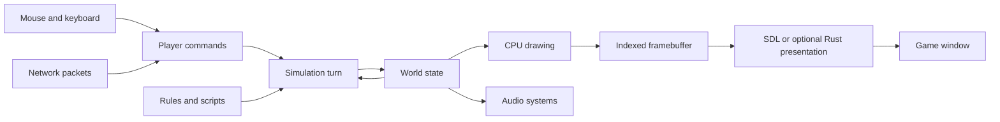
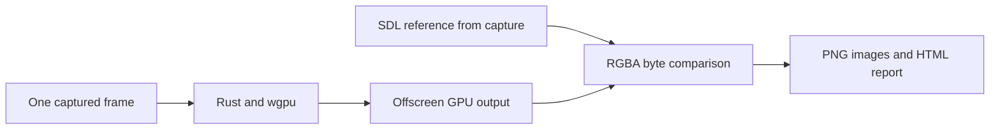

# Understanding KeeperFX

KeeperFX contains both the rules of Dungeon Keeper and a custom engine that runs
those rules. The engine is predominantly C, with C++ used for parts of the platform,
rendering, audio and other systems. Lua extends gameplay scripting. This fork also
contains a Rust indexed-frame renderer used by offline comparison and optional live
Metal presentation on Apple Silicon.

Start with the [documentation index](../README.md) for setup instructions and
references. The engine, game content and operating-system support are useful
conceptual divisions, but many functions share global state rather than operating
as isolated components.

## Purpose of this fork

[zillakot/keeperfx](https://github.com/zillakot/keeperfx) is a personal fork of
[dkfans/keeperfx](https://github.com/dkfans/keeperfx) for learning and incremental
modernization. The current visual direction is to preserve the original pixel art,
sprites and textures as the reference appearance.

| Capability | Implementation and boundary |
| --- | --- |
| Native Apple Silicon game | CMake builds the C/C++ engine; a local `.app` uses Homebrew libraries. See [Mac development](../macos.md). |
| Rust graphics | The same wgpu palette pipeline handles offline replay and optional live surface presentation. See [live Rust presentation](../live-rust-presentation.md). |
| Live gameplay rendering | The existing CPU software renderer draws the world; SDL presents by default. An opt-in Rust/wgpu adapter presents those indexed pixels directly to a Metal surface. |
| Performance | [Final paired live measurements](../performance-baselines.md#recorded-live-presentation-result) establish no reliable overall performance win; SDL already used Metal. Offline replay timings remain development feedback, not gameplay FPS. |
| Repeatable game checks | [Native game control](../native-game-control.md) drives normal in-process input handlers and real SDL window operations in isolated sessions; it does not prove physical OS input delivery. |

The [Rust port plan](../product/rust-port-plan.md) proposes the migration sequence
and validation criteria. Full wgpu drawing is authorized but not yet delivered.
The [active graphics migration](../product/rust-port-plan.md#active-delivery-full-wgpu-drawing)
starts with CPU drawing measurement and command extraction before rasterization,
then covers GPU implementation, all drawing paths and native validation. AI, pathfinding and gameplay simulation remain separate CPU work.
Measure simulation, drawing and presentation separately. Reproducing the current
pixels is a correctness milestone, not an FPS benchmark.

## Startup and the game loop

The platform entry point calls `kfxmain()` in [main.cpp](../../src/main.cpp).
`LbBullfrogMain()` processes startup options, initializes the engine, loads its
configuration and assets, then enters `game_loop()` in
[game_loop.c](../../src/game_loop.c). That loop coordinates the frontend, level
startup, gameplay and returning to menus.

During gameplay, `update()` in [game_update.cpp](../../src/game_update.cpp) performs
one simulation turn. It processes player commands, updates world entities, rooms
and dungeons, advances research and manufacturing, runs level and Lua scripts,
and updates computer players. The default in
[keeperfx.cfg](../../config/keeperfx.cfg) is 20 turns per second. Drawing can run
more frequently, with interpolation controlled separately.

## World state

The global `game` object is defined by `struct Game` in
[game_legacy.h](../../src/game_legacy.h). It holds arrays for players, creatures,
world entities, map blocks, rooms and dungeons. Many relationships use array indices;
`thing_get()` and similar helpers resolve those indices.

A `Thing` represents an entity such as an imp, gold pile, projectile or door.
Creatures also have a `CreatureControl` record for their behavior. Rooms and
per-player dungeons have their own structures. The
[world-data reference](../data_structure.md) explains these types and the terrain
hierarchy.

This shared state is an important modernization constraint. Moving a subsystem
to Rust requires a clear contract for which data it reads and changes. Packed
binary structures also need care: changing their layout can affect serialization
or network compatibility. An in-memory table of callbacks has different
requirements from a serialized game record. Packing controls spacing between
fields in memory; serialization stores data so it can be loaded or transmitted.

## Rendering and platform support

[engine_render.c](../../src/engine_render.c) and the
[software drawing code](../../src/kfx/renderer/software/) draw terrain, sprites
and other scene elements into an indexed framebuffer. Each pixel selects one
entry from a 256-color display palette.

[RendererSoftware.cpp](../../src/kfx/renderer/RendererSoftware.cpp) converts that
image to RGBA and presents it through SDL by default. The optional Rust path uploads
indices and palette and runs the shared palette shader directly into its surface.
On the tested Mac build SDL selected
Metal for presentation; the world itself was still drawn on the CPU. Higher output
resolution cannot add detail to the original artwork.

The newer [renderer interfaces](../../src/kfx/renderer/) provide useful boundaries
for change, but still expose CPU-framebuffer operations. A GPU world renderer
would need scene information such as geometry, sprites, lights and camera state
before the scene becomes pixels.

[PlatformManager.cpp](../../src/kfx/platform/PlatformManager.cpp) exposes platform
services to the rest of the engine. Windows has its own implementation; macOS
currently shares the POSIX implementation in
[PlatformLinux.cpp](../../src/kfx/platform/PlatformLinux.cpp), despite that filename.
[WindowSystemSDL.cpp](../../src/kfx/platform/WindowSystemSDL.cpp) handles windowing
and cursor behavior. The Mac build adds native dependencies and app launch handling.

## Content and configuration

The source checkout supplies code, configuration and some content. A playable
installation also needs complete KeeperFX release assets and the
[required original Dungeon Keeper files](../files_required_from_original_dk.txt).
The original Windows executable is not used by the native Mac engine.

| Location | What to look for |
| --- | --- |
| [config/](../../config/) | Default settings, creature definitions, rules, Lua scripts and mods |
| [campgns/](../../campgns/) | Campaign definitions and related content |
| [levels/](../../levels/), [multiplayer/](../../multiplayer/) | Map packs and multiplayer content |
| `out/game/` | Prepared local installation, runtime settings, saves and logs |
| `out/macos/` | Native engine build and downloaded build dependencies |
| `out/rust-target/` | Rust build output used by the feedback scripts |

Runtime `keeperfx.cfg` controls the installation being played. Editing a source
configuration file does not automatically update an already prepared game folder.
Keep assets, captures and personal saves under ignored output directories.

## Rust frame feedback

The engine's opt-in [capture hook](../../src/kfx/renderer/FrameCapture.cpp) freezes
indices and palette entries together with an SDL reference image from the same
presentation call. The Rust tool then renders exactly that input without a game
window or desktop input.

[frame.rs](../../tools/frame-replay/src/frame.rs) parses the capture,
[gpu.rs](../../tools/frame-replay/src/gpu.rs) runs the GPU pipeline,
[palette.wgsl](../../tools/frame-replay/src/palette.wgsl) performs palette lookup,
and [report.rs](../../tools/frame-replay/src/report.rs) compares the output.
Reusing a captured frame gives repeatable renderer input. New game captures can
vary with clocks and random seeds.

## Finding a feature in the code

| Question | Starting point |
| --- | --- |
| What happens at launch? | [main.cpp](../../src/main.cpp) |
| What happens each turn? | [game_update.cpp](../../src/game_update.cpp) |
| How do creatures choose and perform work? | [creature_jobs.c](../../src/creature_jobs.c), [creature_states.c](../../src/creature_states.c) and related `creature_*` files |
| How do creatures navigate? | [ariadne.c](../../src/ariadne.c) and related `ariadne_*` files |
| How do menus work? | [frontend.cpp](../../src/frontend.cpp), `front_*` and `gui_*` files |
| How are saves and player commands handled? | [game_saves.c](../../src/game_saves.c), [packets.c](../../src/packets.c), `net_*` files |
| How is the engine built? | [CMakeLists.txt](../../CMakeLists.txt), [CMake modules](../../build/cmake/modules/) |

For a first learning exercise, follow a digging command from player input through
tile marking, imp job selection, navigation and terrain changes. Read one behavior
across these systems before trying to replace an entire subsystem.
