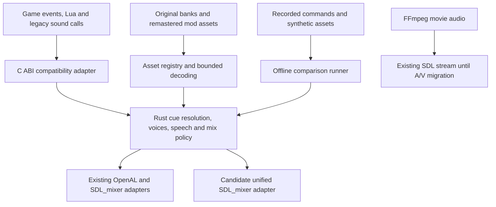

# Audio modernization plan

Modernize both the audio implementation and the sound assets. Improve clarity,
impact, creature character and dungeon atmosphere while retaining Dungeon Keeper's
dark, tactile and mischievous identity. Align engine work with the
[Rust port plan](rust-port-plan.md) and progress independently of live graphics.

Status: A1 and A2 foundations delivered on 2026-09-13; both milestones remain
incomplete. The [cue inventory](../audio/inventory.md),
[audio command references](../audio-reference.md) and
[opt-in audition pack](../audio-audition.md) provide the first implementation and
asset experiments. Original playback remains the default; there is no profile
selector, Rust audio ownership or replacement backend yet.

The inventory records 115 named effect definitions, 417 creature definitions and
125 speech slots, plus two music resolvers. These are source definitions, not
unique recordings or verified language coverage.

The pack contains seven distributable procedural families and a private recipe
for five original-source restoration families. Real OpenAL references cover
idle dungeon, menu and possession. A separate isolated run submitted replacement
`TAB_CLICK` and one `DIG_IMPACT` variant; it does not prove all-pack playback or
listening quality. Offline arranged A/B clips are not gameplay captures.
Headphone/speaker listening, crowded combat, broader lifecycle references and
music-source work remain open. Use the guides' evidence and remaining-work
sections before treating either milestone as complete.

Delivery records are [PR #11](https://github.com/zillakot/keeperfx/pull/11)
(command tracing), [PR #12](https://github.com/zillakot/keeperfx/pull/12)
(inventory) and [PR #13](https://github.com/zillakot/keeperfx/pull/13)
(audition assets). Issues are disabled and no GitHub Project is attached;
implementation and listening evidence belong in the fork's PRs.
[PR #14](https://github.com/zillakot/keeperfx/pull/14) is under review for
same-name override precedence and atomic variant loading; the current source
defect and outstanding runtime checks remain documented in the inventory and
audition guides until that fix lands.

## Intended experience

Ship selectable Original and Remastered profiles. Original retains the existing
assets and mix rules as a reference. Remastered provides a coherent replacement
or remaster pack and separately tuned mix. Keep Original as the default through
the initial experiments; decide the release default after evaluating the pack.
The remaster must remain usable with the original graphics.

| Area | Direction and audition criteria |
| --- | --- |
| UI and building | Short, tactile clicks and impacts; distinguish acceptance, refusal, placement and sale without tiring repetition. Preserve rapid interaction timing. |
| Digging and combat | Layer material, weight and impact; make important events readable in a crowded fight. Preserve attack and impact timing rather than adding long cinematic tails everywhere. |
| Creatures | Distinct vocal and movement character by creature, action and material, with controlled variants. Avoid turning the dungeon into continuous overlapping cries. |
| Dungeon ambience | Seamless room and environmental loops, subtle variation and transitions between dungeon overview and possession. Preserve silence and spatial contrast. |
| Mentor and speech | Preserve intelligibility, language coverage, cue timing and character. Compare conservative restoration with any proposed new recordings; actor replacement is a separate creative decision. |
| Music and movies | Preserve the ominous musical identity and existing script/track meaning. Evaluate a restored music excerpt before commissioning replacements. Check movie audio transitions and synchronization separately. |

Remaster from the best available source first. Selective noise removal, click
repair, careful equalization and level matching may help; resampling cannot
recover detail absent from the source. Replace cues whose sources cannot meet the
direction with new recordings, synthesis or appropriately licensed material.
Do not normalize every cue to the same loudness: relative loudness is part of the
mix, especially for mentor speech and frequent UI feedback.

## Current implementation and constraints

| Component | Source and consequence |
| --- | --- |
| Playback | [bflib_sndlib.cpp](../../src/bflib_sndlib.cpp) owns OpenAL effects and banked speech, SDL3_mixer music and streamed speech, bank parsing and custom decoding. Changing one device path does not migrate all audio. |
| Spatial behavior | [bflib_sound.c](../../src/bflib_sound.c) calculates distance, pan, pitch, emitter updates and sample selection. [sounds.c](../../src/sounds.c) derives the listener from the camera, including zoom and possession behavior. Preserve these calculations before retuning spatial sound. |
| Capacity | `SOUNDS_MAX_COUNT` is 16 and `SOUND_EMITTERS_MAX` is 128 in [bflib_sound.h](../../src/bflib_sound.h). Initialization requests 100 OpenAL sources, but `S3DSetNumberOfSounds()` clamps the managed sample count to 16. Measure saturation at both layers before increasing capacity. |
| Speech | [gui_soundmsgs.cpp](../../src/gui_soundmsgs.cpp) handles queue limits, duplicate/recent-message suppression and file lookup. Banked speech and streamed speech follow different playback and volume paths. |
| Content and scripting | [sounds.cfg](../../config/fxdata/sounds.cfg), [config_sounds.c](../../src/config_sounds.c) and [lua_api_sound.c](../../src/lua_api_sound.c) already support named cues, numeric redirects, variants, stacking rules and custom files. Extend this system instead of creating a competing asset registry. |
| Facade | [SoundManager](../../src/sound_manager.cpp) remains a partial wrapper. `playEffect()` ignores its priority and volume parameters and returns the shared `Non3DEmitter`; `stopEffect()` destroys that emitter and its samples. Capture current behavior, then fix these contracts explicitly. |
| Asset lifetime | Campaign snapshots, map overrides and [save loading](../../src/game_saves.c) rebuild custom sound state. A playback handle must never become a persistent asset identity. |
| Movies | [bflib_fmvids.cpp](../../src/bflib_fmvids.cpp) decodes with FFmpeg and owns a separate SDL audio stream. Include it in device/shutdown tests; migrate its output only with A/V timing evidence. |

Original banks include legacy WAV handling, including a special conversion for
`heart6a.wav`. Custom decoding includes WAV, MP3, BMU-wrapped MP3 and SDL-decoded
formats such as OGG/FLAC. Stereo and mono paths differ. Inventory and compare the
actual decoded output before replacing parsers or codecs; a new decoder is not
automatically compatible with these files.

## Asset workstream

First create a cue inventory from the named registry, numeric call sites, creature
configs, speech definitions, music resolution and representative mods. Give each
entry a stable cue key, legacy IDs, variants, category, trigger, duration, loop
points, source format, channel layout, language and current override behavior.
Record whether to retain, restore or replace it, along with its source, creator,
license or permission, and redistribution status. Keep source provenance with
the editable master and export recipe.

Build a small audition pack before expanding across the catalog:

- UI confirmation/refusal and a room placement or sale cue.
- Digging and one combat impact family, including a rapid burst.
- One creature's movement, hurt and death family, with variants.
- Dungeon-heart and water/room ambience, including a seamless loop.
- One representative mentor line and one music excerpt where usable sources are available.

Target roughly 10–15 cue families; this is a representative vertical slice, not
an estimate of the whole catalog. Deliver matched Original/Remastered A/B clips,
an in-game configuration pack and a manifest of replaced cues and unresolved
source rights. Include quiet and crowded mixes and the transition into possession.
Level-match comparisons so louder playback cannot masquerade as better quality.

Use lossless editable masters; 48 kHz/24-bit WAV is a proposed production default
for new recordings, while source restoration retains the original source too.
Export mono world cues where positioning requires it and stereo music or beds
where intentional. Audition deliberate channel conversions. Specify gain, trim,
loop points and variant grouping in a reproducible export recipe. Validate file
decoding, excessive peaks, unintended silence, loop seams and variant continuity.
Set final loudness and peak targets from the audition mix, before bulk production.

Prefer a normal mod/config pack for the first audition. Explicitly verify its
precedence against campaign and map overrides, including after-map mods: do not
silently replace a campaign's custom cue. Missing remastered cues fall back to the
Original asset. Language fallback follows the existing lookup rules, and missing
recordings remain visible in the manifest. Package distributable new assets
separately from original game files; restoration that requires original assets
can use a local transformation recipe until redistribution is established.

## Engine direction

Move KeeperFX audio policy and ownership into a Rust library behind a narrow C
interface. Initially retain the existing OpenAL and SDL3_mixer playback adapters.
This separates language migration from audible backend differences.

The preferred consolidation experiment is SDL3_mixer because it is already a
dependency and supports track gain, pitch/speed adjustment and panning. Its
[memory mixer](https://wiki.libsdl.org/SDL3_mixer/MIX_CreateMixer) and
[output generation](https://wiki.libsdl.org/SDL3_mixer/MIX_Generate) also provide
an offline testing path. These are capabilities, not proof of matching this game.

| Option | Decision |
| --- | --- |
| Rust policy with existing OpenAL + SDL3_mixer | First live migration target; preserves a comparison backend while transferring bounded responsibilities. |
| Rust policy with consolidated SDL3_mixer output | Preferred later experiment; adopt only after gain, pan, pitch, latency, streaming and lifecycle checks pass. |
| Rust game-audio library such as [Kira](https://docs.rs/kira/latest/kira/) | Reconsider if authored transitions, effects and spatial requirements justify another stack. Kira offers tweens, mixer effects, clocks and spatial audio; a language match alone does not justify replacing working dependencies. |

Keep the current distance and Doppler rules in the compatibility path and map
their output to backend parameters. SDL_mixer's
[3D API](https://wiki.libsdl.org/SDL3_mixer/MIX_SetTrack3DPosition) lacks OpenAL's
full distance/Doppler controls and downmixes tracks to mono; enabling it would
change behavior. Even [stereo panning](https://wiki.libsdl.org/SDL3_mixer/MIX_SetTrackStereo)
needs calibration against the existing OpenAL position-based pan implementation.
Pin the tested bindings/library versions and verify the actual platform builds.

This is the target decomposition, not a new implementation. Only one playback
backend is audible in a run; comparison runs must not duplicate sound or consume
game random values a second time.

The boundary uses versioned, fixed-width records, explicit lengths and opaque
generational voice handles. Keep asset identity, emitter identity and individual
playback instances distinct. Do not pass packed engine structs, C `long`, C++
containers or pointers into mutable game state as the Rust data model. Define
copy/borrow lifetimes, range checks, destruction order and explicit errors; no
panic or exception may unwind across the ABI.

Begin with synchronous control on the game thread. Decode/preload short cues
outside the real-time callback and stream longer music with bounded buffering.
Callbacks must not read game globals, perform file I/O, allocate unbounded data,
log synchronously or acquire game locks. If a command queue becomes necessary,
specify capacity, overload reporting, completion delivery and guaranteed handling
of stop/shutdown commands. Rebuild device resources on recovery without retaining
stale voices or replaying the speech backlog as a burst.

Retain existing volume controls first. A later Remastered mix can add ambience
control, mentor-driven ducking and controlled peak limiting. Define each gain
stage once, including the differing legacy volume ranges; keep same-cue `STACK=duck`
separate from speech-driven ducking. Higher voice budgets, virtualization, reverb,
occlusion and enhanced spatial processing follow measured need and listening tests.

## Delivery sequence

The content and engine tracks can proceed alongside graphics. Each row is a
bounded milestone that may need several PRs, not a single-session estimate.

| Milestone | Deliverable | Exit evidence |
| --- | --- | --- |
| A1. Inventory and reference | Cue manifest, isolated audio capture scenarios and command tracing; retained baseline executable and dependency versions. | Menu, quiet dungeon, crowded combat, possession, mentor, music, save/reload and movie references; measured voice/drop counts and audio-enabled frame costs. |
| A2. Audition pack | The representative remaster/replacement pack, source provenance, export recipe and A/B clips. Can run on the current engine. | In-game listening on headphones and speakers; recognizable cues, clear speech, clean loops and preserved trigger timing. Record remaining creative decisions before bulk production. |
| A3. Compatibility boundary | Backend adapter and Rust testable library; first migrate a bounded operation such as cue-ID resolution and stack admission. Retain legacy sample scheduling until its own comparison passes. | Exact policy decisions against recorded inputs; explicit tests for the wrapper's volume, priority and shared-emitter behavior, with intentional fixes recorded separately. |
| A4. Rust audio ownership | Move voice lifecycle, emitter updates, queue/mix policy and bank lifecycle in separate slices using the existing backends. | Lua, redirects, same-emitter restart, stacking, speech order, campaign/map reset and save/reload pass; fallback build remains playable. |
| A5. Backend consolidation experiment | Optional SDL3_mixer effects path, with bounded decoding and calibrated spatial behavior. Integrate movie output in a later slice if justified. | Offline signal comparisons and live device/latency tests pass; no doubled attenuation, lost loops or channel changes; A/V sync measured if movie ownership moves. Keep OpenAL if parity remains unresolved. |
| A6. Full pack and release | Expand the approved direction by cue family and language; tune Remastered mix, package profiles and document coverage. | Catalog coverage/fallback report, listening matrix and platform checks; select the default explicitly. Retire legacy code only after its callers and behavior are covered. |

Start with A1 and A2. They give an audible result and a reference for later Rust
work without waiting for graphics or committing to a new playback dependency.
Estimate full production after the cue count, source quality, localization gaps
and time spent on the representative pack are known.

## Validation contract

Use separate evidence for policy, audio output and listening:

- **Policy:** record requested and resolved cue IDs, event order, the audio tick,
  game turn, seed/selected variation, emitter and voice IDs, gain/pan/pitch,
  looping, priority, start/stop/restart/drop reason and backend completions.
  Replay the same completion schedule for policy comparisons. Cover menu ticks
  while the game turn is stationary, default once-per-tick gates, explicit
  duration-based `STACK=limit/duck`, same-emitter restart and voice exhaustion.
  Preserve random-number consumption and game state; audio device timing must
  never drive simulation decisions.
- **Signal:** synthetic impulses, tones, silence and loop fixtures cover duration,
  channel order, gain, panning, pitch, fades, stops and clipping. Require exact
  output only for fixed deterministic stages and pinned configurations. Establish
  documented amplitude/timing tolerances from the legacy captures before backend
  comparisons; do not demand byte equality between different resamplers or use
  unrestricted tolerances to hide differences. Remastered assets intentionally
  differ and are judged against their cue/production contract.
- **Runtime:** exercise cue start/stop independently, sliders and mute, pause and
  focus transitions, music changes, language fallback, ZIP/custom formats, bad or
  missing files, campaign/map changes, save/reload and shutdown. Test no-device
  startup, initialization failure, device switching/disconnection, recovery and
  `-nosound`. Repeated level loads must reach a stable memory/voice baseline.
- **Performance:** measure request-to-output latency, decode stalls, audio update
  CPU time, peak voices, drops, memory and available underrun diagnostics with
  audio enabled. Report measured values and device/buffer settings; software
  submission timing alone is not end-to-end audible latency. Set regression
  budgets from A1, then repeat the same busy scenes after each engine milestone.
- **Listening:** audition both profiles on headphones and speakers, in quiet and
  crowded scenes and during possession. Check fatigue, directional readability,
  loop seams, speech masking and consistent identity. Log clip/scenario/settings
  and findings; passing CI is not evidence that the remaster sounds good.

CI uses synthetic or redistributable fixtures and format/error/ABI tests. Original
game assets and their recordings remain local unless distribution is authorized.
For engine integration, explicitly run macOS, Windows and Linux build checks:
the current prototype Windows/Linux workflow only triggers on selected PR events,
so ordinary green PR checks alone do not establish those platforms were built.
Claim runtime support only on platforms actually exercised; Apple Silicon is the
first live target, with Windows and Linux/Steam Deck validation before claiming
remastered release support there.

## Coordination with graphics

Keep audio assets, library and replay fixtures separate from frame replay. Agree
ownership before touching shared CMake/Cargo wiring, startup/shutdown, game-loop
hooks, SDL events or settings. Neither subsystem may independently call global
SDL shutdown while the other still owns resources. Use separate worktrees and
small integration PRs so a graphics change cannot overwrite audio changes.

Existing frame capture runs with `-nosound`; its success provides no audio evidence.
Keep that visual fixture isolation and add dedicated audio-enabled scenarios.
After either live backend integrates, run combined resize/focus/fullscreen,
possession, music, save/reload and shutdown checks. Confirm uninterrupted audio
through graphics stalls and unchanged game/sound event ordering.
